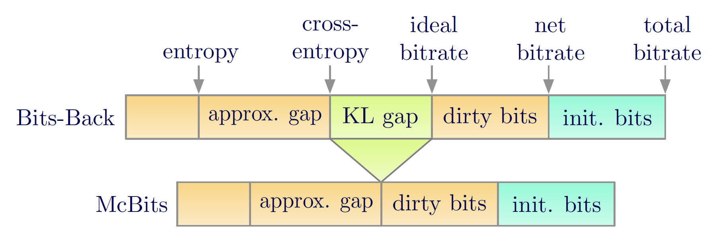

# Monte Carlo Bits-Back Coding (McBits)
This repository contains the official implementation for [Improving Lossless Compression Rates via Monte Carlo Bits-Back Coding](https://arxiv.org/abs/2102.11086) (ICML 2021 Oral).

<p align="center"></p>

## Setup
Install the conda environment:
```
conda env create -f environment.yml
conda activate mcbits
pip install -e .
```
If you update the environment, please also update the environment file:
```
conda env export --name mcbits | grep -v "^prefix: " > environment.yml
```

## Repo Structure
The McBits implementation are included in the [`mcbits`](./mcbits) directory, where the rANS is implemented in [`mcbits/rans.py`](./mcbits/rans.py) 
and all McBits coders are in [`mcbits/coders.py`](./mcbits/coders.py). 

The code for reproducing our experiments is in the [`experiments`](./experiments) directory. We include the toy experiment ([`experiments/toy_data`](./experiments/toy_data)), 
lossless image compression on the EMNIST dataset ([`experiments/img_emnist`](./experiments/img_emnist)), and loessless sequential data compression 
on pianoroll datasets ([`experiments/seq_pianoroll`](./experiments/seq_pianoroll)). Each includes a README for executing the 
pipeline and reproducing the results.

**Note**: the current rANS implementation is not parallelized. The faster parallel implementation based on JAX will be released soon!


## Citation
If you find this work relevant to your work, please cite our paper:
```
@inproceedings{ruan2021improving,
  title={Improving Lossless Compression Rates via Monte Carlo Bits-Back Coding},
  author={Ruan, Yangjun and Ullrich, Karen and Severo, Daniel and Townsend, James and Khisti, Ashish and Doucet, Arnaud and Makhzani, Alireza and Maddison, Chris J},
  booktitle={International Conference on Machine Learning},
  year={2021},
}
```

## Acknowledgement
The rANS implementation is closely based on the [note](https://fgiesen.wordpress.com/2014/02/02/rans-notes/) by Fabian Giesen and the [bits-back](https://github.com/bits-back/bits-back) repo.
